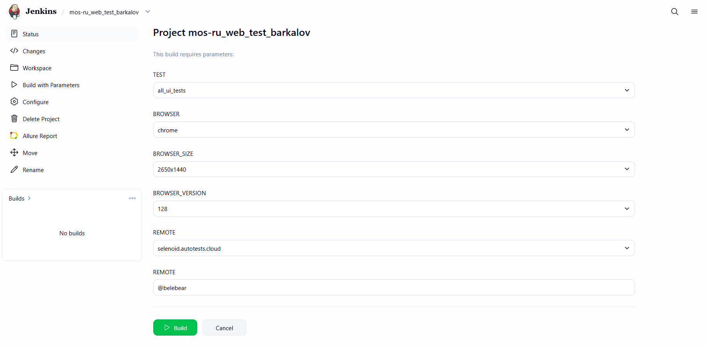
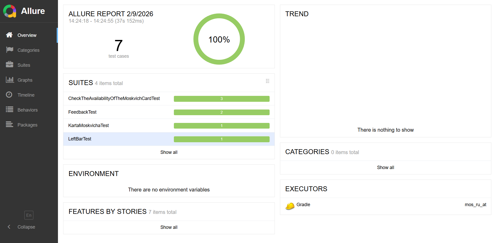
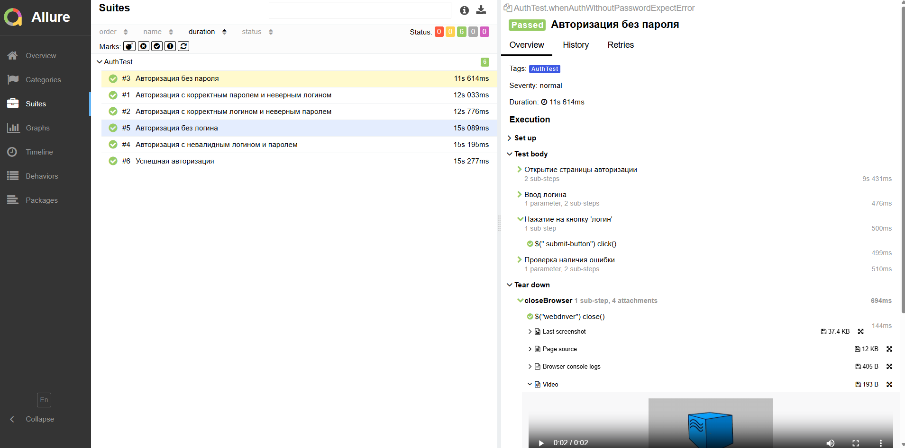
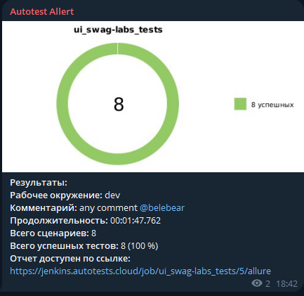
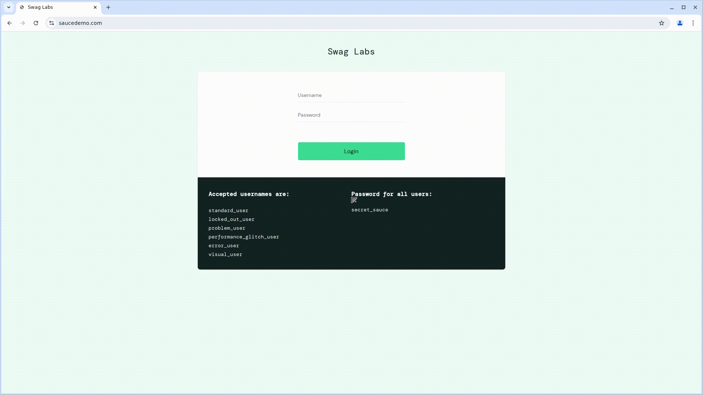

# Автоматизация тестирования [Mos.ru](https://www.mos.ru)

## <a name="Технологии и инструменты">**Технологии и инструменты:**</a>

<p align="center">  
<a href="https://www.jetbrains.com/idea/"></a>  
<a href="https://www.java.com/"></a>  
<a href="https://github.com/"></a>  
<a href="https://junit.org/junit5/"></a>  
<a href="https://gradle.org/"></a>  
<a href="https://selenide.org/"></a>  
<a href="https://aerokube.com/selenoid/"></a>  
<a href="ht[images](images)tps://github.com/allure-framework/allure2"></a> 
<a href="https://qameta.io/"></a>   
<a href="https://www.jenkins.io/"></a>  
</p>

## Примеры автоматизированных тест-кейсов:
- Проверка авторизации с валидными данными
- Проверка авторизации с невалидными данными
- Проверка пунктов меню
- Проверка работоспособности кнопок

---

## Запуск тестов через терминал:

#### Для локального запуска
- Запуск тестов на странице "Карта москвича"
``` bash 
gradle clean karta_moskvicha_test
```
- Запуск тестов по левому боковому меню
``` bash 
gradle clean left_bar_test
```
- Запуск тестов на странице проверки карты москвича
``` bash 
gradle clean check_card_test
```
- Запуск тестов на странице обратной связи
``` bash 
gradle clean feedback_test
```
- Запуск тестов на новостной странцие
``` bash 
gradle clean news_test
```
- Запуск всех ui тестов
``` bash 
gradle clean all_ui_tests // Запуск всех ui тестов
```

#### Для запуска из Jenkins
``` bash 
clean ${TESTS} -Dremote=https://user1:1234@${REMOTE}/wd/hub -Dbrowser=${BROWSER} -DbrowserSize=${BROWSER_SIZE} -DbrowserVersion=${BROWSER_VERSION}
```

## Сборка в [Jenkins](https://jenkins.autotests.cloud/job/38-belebear-rigla_project_lesson12/) 

### Возможные параметры сборки в Jenkins:
<p align="center">  

</p>

- BROWSER - параметр для выбора браузера
- BROWSER_SIZE - параметр для выбора разрешения, в котором будет открыт браузер
- BROWSER_VERSION - параметр для выбора версии браузера
- REMOTE - параметр для ввода адреса удаленного сервера, где будут выполняться тесты
- TEST - параметр отвечающий за запуск по тестовой модели
- COMMENT - параметр, отвечающий за сообщение, которое будет отправлено в телеграм с отчетом

## Отчетность в [Allure](https://jenkins.autotests.cloud/job/38-belebear-rigla_project_lesson12/allure/) 

### Главная страница Allure Reports

<p align="center">  

</p>

### Страница со всеми тест-кейсами и шагами

<p align="center">  

</p>

### По итогу прохождения тестов формируются:
- Скриншоты
- Код страницы
- Видео прохождения теста
- Логи

## Отчетность в Telegram 

### Краткий отчет после прохождения тестов от чат-бота

<p align="center">  

</p>

## Пример видео с выполнением теста
<p align="center">  

</p>
